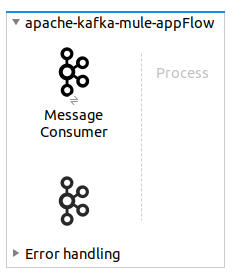

# MuleSoft kafka connector

This page explains how to configure the kafka connectors on MuleSoft Anypoint Studio. 

By following this tutorial, you will be able to consume Kafka messages from MuleSoft, transform those messages into Soap Request and read the soap response from the mock Soap Server. 

Soap responses and requests will be logged into **/your/preferred/path/logs** directory.

At the end of this guide, you will have a flow like :


## Pre-requisite
Before starting the guide, make sure that :
* You have done all the settings described in this [page](https://github.com/nexDigitalDev/confluent-kafka-demo/blob/master/README.md).
* You have installed [MuleSoft Anypoint Studio](https://www.mulesoft.com/lp/dl/studio).
* You have installed [SOAP UI](https://www.soapui.org/).


## Configure SOAP UI

This part is optional if you have already a running Soap Server. 

Open Soap UI and create a new SOAP Project using the wsdl file at **/your/preferred/path/confluent-kafka-demo/mule/airbus-hello.wsdl**.

Click on **Hello_Binding** and create a MockService with **path** configured to **/SayHello** on the port **9099**.

</img>

Click on the Mock Service that you created and run it.


## Configuring MuleSoft

### Kafka Connector

First, create a new mule project and open it.
In the **Mule Palette** side menu, click on **Search in Exchange...**
Seach for the **Kafka Connector** and add it to the project.


Drag the **Message Consumer** in the flow. Your flow looks like as follow now :



Click on the **Message Consumer** in the flow, and in **General > Basic Settings** click on the **"+"** button to add a connector configuration for the Apache Kafka Consumer.

Select **Kafka Basic Consumer Connection** for Connection field and fill other fields as the following image shows :


Pass the topic name **TRAFFIC_ENRICHED** in **General > General > Topic**.


### Transform Json String to Json Object
After that, add a **Transform Message** module in the flow. This module will convert the Json String into Json Object.

Click on this module in the flow and modify the output as :

```java
%dw 2.0
output application/json
---
{
	traffic:read(payload,"application/json")
}
````

### Transform Json Object to Soap-XML

Add a new **Transform Message** module in the flow. This module transform the Json Object to the Soap-XML Format and modify the output as follow :

```java
%dw 2.0
output application/xml writeDeclaration=false
ns soapenv http://schemas.xmlsoap.org/soap/envelope/
ns hel http://www.examples.com/wsdl/HelloService.wsdl
---

{
	soapenv#Envelope: {
		soapenv#Body: {
				date: payload.traffic.DATE,
				vol: payload.traffic.VOL,
				depart: payload.traffic.DEPART,
				arrivee: payload.traffic.ARRIVEE,
				appareil: (payload.traffic.APPAREIL
default "") ++ payload.traffic.APPAREIL,
				distance: payload.traffic.DISTANCE,
				"type": payload.traffic.T_TYPE,
				aircraft: payload.traffic.AIRCRAFT,
				longueur: payload.traffic.LONGUEUR,
				autonomie: payload.traffic.AUTONOMIE,
				passagers: payload.traffic.PASSAGERS
		}
	}
	
}
```
> If you use another Soap Server, please adapt the above output format.

### Log Soap Request to File

After the previous **Transform Message** module, add a **Logger** module in the flow. There is typically nothing to configure with this log module.

Then, add a **File Write** module. Configure the **General > General > Path** to **/your/preferred/path/confluent-kafka-demo/logsrequestLog.txt** and set the **Write Mode** (set to **APPEND** if you want to keep every request).

### HTTP Request

Add the **HTTP Request** module to the flow.
Configure the **General > Request** as the following image shows :


>If you use another Soap server, please modify the URL.

### Log Soap Response to File

By the same way, add a **Logger** module and a **File Write** module in the flow to log the Soap Response.

Configure the **File Write** module to log the reponses into the **/your/preferred/path/confluent-kafka-demo/logsresponseLog.txt** file.

## Test your flow

Now, launch your application and test the configuration by passing new streaming data.

